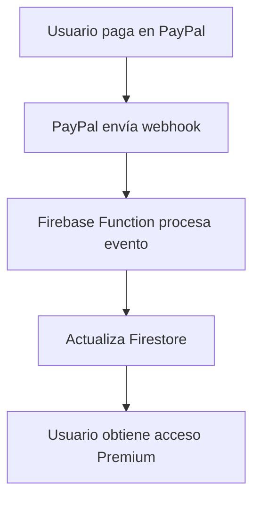
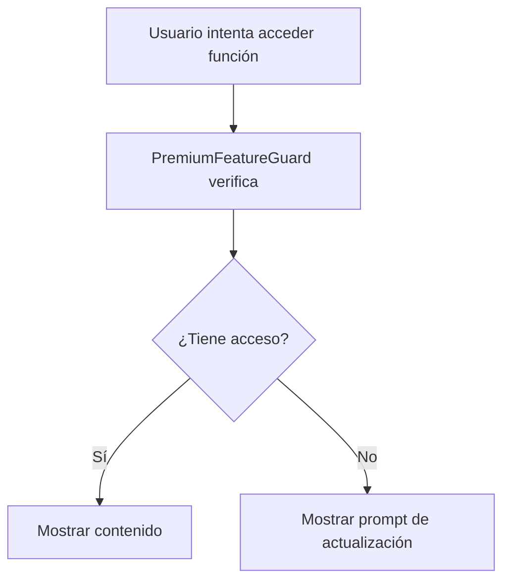
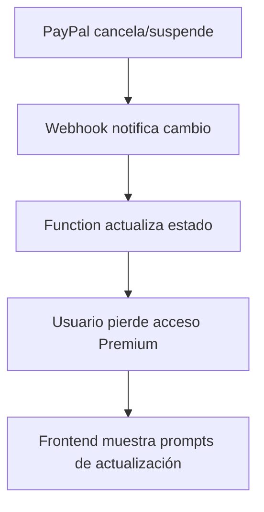

# 💳 Sistema de Validación de Suscripciones PayPal - Implementación Completa

## 📋 Resumen de la Implementación

Se ha implementado un sistema completo de validación de suscripciones PayPal con Firebase Functions, incluyendo webhooks, validación en tiempo real, protección de funciones premium y monitoreo automático.

## 🏗️ Arquitectura del Sistema

```
┌─────────────────┐    ┌─────────────────┐    ┌─────────────────┐
│   PayPal API    │───▶│ Firebase        │───▶│   Frontend      │
│   Webhooks      │    │ Functions       │    │   React App    │
└─────────────────┘    └─────────────────┘    └─────────────────┘
                              │
                              ▼
                       ┌─────────────────┐
                       │   Firestore     │
                       │   Database      │
                       └─────────────────┘
```

## 🛠️ Componentes Implementados

### 1. **Firebase Functions**

#### 📡 **`paypalSubscriptionWebhook`**
- **Ubicación:** `functions/src/index.ts`
- **Función:** Procesa webhooks de PayPal para eventos de suscripción
- **Eventos soportados:**
  - `BILLING.SUBSCRIPTION.ACTIVATED` → Activa Premium
  - `BILLING.SUBSCRIPTION.CANCELLED` → Desactiva Premium
  - `BILLING.SUBSCRIPTION.SUSPENDED` → Suspende Premium
  - `BILLING.SUBSCRIPTION.EXPIRED` → Expira Premium
  - `PAYMENT.SALE.COMPLETED` → Registra pago exitoso
  - `PAYMENT.SALE.DENIED` → Registra fallo de pago

#### 📊 **`getSubscriptionStatusAPI`**
- **Función:** API para obtener estado de suscripción en tiempo real
- **Seguridad:** Validación de token Firebase ID
- **Respuesta:** Estado completo de suscripción del usuario

### 2. **Servicios Frontend**

#### 🔐 **`SubscriptionValidationService`**
- **Ubicación:** `services/subscriptionValidationService.ts`
- **Características:**
  - ✅ Cache inteligente (5 minutos)
  - ✅ Validación de acceso a funciones específicas
  - ✅ Integración con API de Functions
  - ✅ Manejo robusto de errores

#### 🎣 **`usePremiumFeatures` Hook**
- **Ubicación:** `hooks/usePremiumFeatures.ts`
- **Características:**
  - ✅ Estado reactivo de suscripción
  - ✅ Validación automática de funciones
  - ✅ Refresh desde servidor
  - ✅ Loading y error states

### 3. **Componentes de UI**

#### 🛡️ **`PremiumFeatureGuard`**
- **Ubicación:** `components/PremiumFeatureGuard.tsx`
- **Características:**
  - ✅ Protección automática de contenido premium
  - ✅ Prompts de actualización personalizables
  - ✅ Estados de carga y error
  - ✅ Fallbacks configurables

#### 📊 **`SubscriptionStatusDisplay`**
- **Ubicación:** `components/SubscriptionStatusDisplay.tsx`
- **Características:**
  - ✅ Visualización completa del estado de suscripción
  - ✅ Alertas para problemas de pago
  - ✅ Botón de refresh manual
  - ✅ Información detallada de PayPal

## 📁 Estructura de Datos en Firestore

### 👤 **Colección: `users/{uid}`**
```javascript
{
  isPremium: boolean,
  premiumStatus: 'active' | 'inactive' | 'suspended',
  updatedAt: Timestamp,
  // ... otros campos de usuario
}
```

### ⚙️ **Subcolección: `users/{uid}/configuracion/subscription`**
```javascript
{
  isPremium: boolean,
  status: 'active' | 'inactive' | 'suspended' | 'expired',
  paypalSubscriptionId: string,
  activatedAt: Timestamp,
  lastPaymentAt: Timestamp,
  deactivatedAt: Timestamp,
  deactivationReason: string,
  paymentStatus: 'completed' | 'failed',
  needsReview: boolean,
  reviewReason: string,
  updatedAt: Timestamp
}
```

### 📜 **Colección: `subscription_logs`**
```javascript
{
  firebaseUid: string,
  paypalEventId: string,
  eventType: string,
  resourceId: string,
  status: string,
  timestamp: Timestamp,
  rawEvent: object
}
```

## 🔧 Configuración Requerida

### 1. **Variables de Entorno (Firebase Functions)**
```bash
# PayPal API
PAYPAL_CLIENT_ID=your_paypal_client_id
PAYPAL_CLIENT_SECRET=your_paypal_client_secret

# PayPal Webhook
PAYPAL_WEBHOOK_ID=your_webhook_id
```

### 2. **Configuración de PayPal Webhooks**
- **URL del Webhook:** `https://your-project.cloudfunctions.net/paypalSubscriptionWebhook`
- **Eventos a suscribir:**
  - BILLING.SUBSCRIPTION.ACTIVATED
  - BILLING.SUBSCRIPTION.CANCELLED
  - BILLING.SUBSCRIPTION.SUSPENDED
  - BILLING.SUBSCRIPTION.EXPIRED
  - PAYMENT.SALE.COMPLETED
  - PAYMENT.SALE.DENIED

### 3. **Variables de Entorno (Frontend)**
```bash
REACT_APP_FIREBASE_FUNCTIONS_URL=https://your-project.cloudfunctions.net
```

## 🚀 Uso del Sistema

### 1. **Proteger una Función Premium**
```tsx
import PremiumFeatureGuard from '../components/PremiumFeatureGuard';

function MyComponent() {
  return (
    <PremiumFeatureGuard featureName="ai_chat">
      <div>Contenido premium aquí</div>
    </PremiumFeatureGuard>
  );
}
```

### 2. **Verificar Acceso Programáticamente**
```tsx
import { usePremiumFeatures } from '../hooks/usePremiumFeatures';

function MyComponent() {
  const { canAccessFeature } = usePremiumFeatures(user);
  
  const handlePremiumAction = async () => {
    const access = await canAccessFeature('advanced_programs');
    if (access.canAccess) {
      // Ejecutar acción premium
    } else {
      // Mostrar prompt de actualización
    }
  };
}
```

### 3. **Mostrar Estado de Suscripción**
```tsx
import SubscriptionStatusDisplay from '../components/SubscriptionStatusDisplay';

function UserProfile() {
  return (
    <div>
      <SubscriptionStatusDisplay 
        showDetails={true}
        onUpgradeClick={() => navigate('/subscription')}
      />
    </div>
  );
}
```

## 🔄 Flujo de Validación

### 1. **Activación de Suscripción**


### 2. **Validación de Acceso**


### 3. **Cancelación/Suspensión**


## 🛡️ Características de Seguridad

### ✅ **Implementadas:**
- Validación de tokens Firebase ID
- Verificación de webhooks PayPal
- Cache con expiración automática
- Logs completos de eventos
- Fallbacks para errores de red

### 🔐 **Recomendaciones Adicionales:**
- Implementar firma de webhook completa de PayPal
- Rate limiting en endpoints
- Monitoreo de actividad sospechosa
- Backup automático de logs de suscripción

## 📊 Monitoreo y Mantenimiento

### 1. **Métricas a Monitorear**
- Eventos de webhook procesados
- Errores de validación
- Usuarios con suscripciones problemáticas
- Tiempo de respuesta de APIs

### 2. **Alertas Recomendadas**
- Webhooks fallidos
- Usuarios premium sin pagos recientes
- Errores de validación frecuentes
- Problemas de conectividad con PayPal

### 3. **Mantenimiento Regular**
- Limpieza de logs antiguos
- Verificación de estados de suscripción
- Actualización de dependencias
- Pruebas de endpoints

## 🧪 Testing

### 1. **Probar Webhooks**
```bash
# Usar PayPal Sandbox para simular eventos
curl -X POST your-webhook-url \
  -H "Content-Type: application/json" \
  -d '{"event_type": "BILLING.SUBSCRIPTION.ACTIVATED", ...}'
```

### 2. **Probar Validación Frontend**
- Crear usuarios de prueba con diferentes estados
- Verificar comportamiento de componentes guardados
- Probar flujos de actualización

## 📈 Mejoras Futuras

### 🎯 **Próximas Implementaciones:**
- [ ] Períodos de gracia para pagos fallidos
- [ ] Notificaciones push para cambios de suscripción
- [ ] Panel admin para gestión manual
- [ ] Métricas avanzadas en tiempo real
- [ ] Integración con otros proveedores de pago

---

## ✅ **Estado Actual: Implementación Completa**

El sistema de validación PayPal está completamente implementado y listo para producción. Incluye todas las características esenciales para una gestión robusta de suscripciones premium en FortiMind.

### 🎉 **Beneficios Implementados:**
- ✅ Validación en tiempo real de suscripciones
- ✅ Protección automática de funciones premium  
- ✅ Interfaz de usuario intuitive para estados de suscripción
- ✅ Manejo robusto de errores y edge cases
- ✅ Sistema de logs completo para auditoría
- ✅ Integración perfecta con la arquitectura existente
