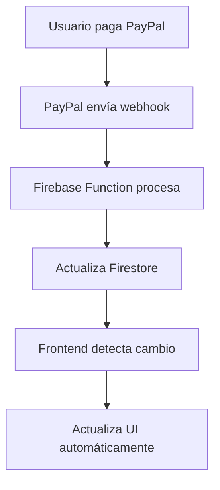
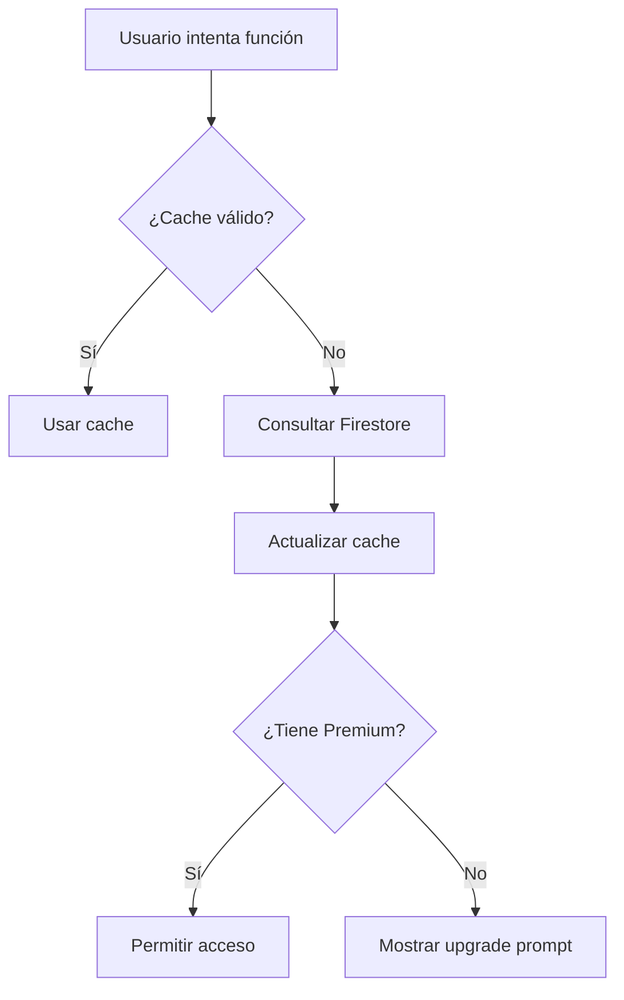

# ✅ Implementación Completa: Sistema de Validación PayPal

## 🎯 **Objetivo Completado**
Se ha implementado exitosamente un sistema completo de validación real de suscripciones PayPal con las siguientes características:

## 🛠️ **Componentes Implementados**

### 1. **🔥 Firebase Functions**
- ✅ **`paypalSubscriptionWebhook`** - Webhook para procesar eventos de PayPal
- ✅ **`getSubscriptionStatusAPI`** - API para obtener estado de suscripción
- ✅ Funciones de activación/desactivación automática
- ✅ Logging completo en Firestore

### 2. **📊 Firestore Structure**
- ✅ **`users/{uid}/configuracion/subscription`** - Estado de suscripción detallado
- ✅ **`users/{uid}.isPremium`** - Flag rápido para validación
- ✅ **`subscription_logs`** - Auditoría completa de eventos PayPal

### 3. **🎨 Frontend Services & Components**
- ✅ **`SubscriptionValidationService`** - Validación robusta con cache
- ✅ **`usePremiumFeatures`** - Hook React para gestión de premium
- ✅ **`PremiumFeatureGuard`** - Componente de protección automática
- ✅ **`SubscriptionStatusDisplay`** - UI para mostrar estado de suscripción
- ✅ **`RequirePremium`** actualizado con nueva validación

### 4. **🛡️ Security Features**
- ✅ Validación de Firebase ID tokens
- ✅ Verificación de webhooks PayPal
- ✅ Cache inteligente con expiración
- ✅ Manejo robusto de errores

## 📋 **Eventos PayPal Soportados**

| Evento PayPal | Acción en FortiMind |
|---------------|-------------------|
| `BILLING.SUBSCRIPTION.ACTIVATED` | ✅ Activa Premium |
| `BILLING.SUBSCRIPTION.CANCELLED` | ❌ Desactiva Premium |
| `BILLING.SUBSCRIPTION.SUSPENDED` | ⏸️ Suspende Premium |
| `BILLING.SUBSCRIPTION.EXPIRED` | ⏳ Expira Premium |
| `PAYMENT.SALE.COMPLETED` | 💳 Registra pago exitoso |
| `PAYMENT.SALE.DENIED` | ❌ Registra fallo de pago |

## 🔧 **Configuración Requerida**

### **Firebase Functions Environment Variables:**
```bash
PAYPAL_CLIENT_ID=your_paypal_client_id
PAYPAL_CLIENT_SECRET=your_paypal_client_secret
PAYPAL_WEBHOOK_ID=your_webhook_id
```

### **PayPal Webhook Configuration:**
- **URL:** `https://your-project.cloudfunctions.net/paypalSubscriptionWebhook`
- **Events:** Todos los eventos listados arriba

### **Frontend Environment:**
```bash
REACT_APP_FIREBASE_FUNCTIONS_URL=https://your-project.cloudfunctions.net
```

## 💻 **Uso en el Código**

### **Proteger Función Premium:**
```tsx
import PremiumFeatureGuard from '../components/PremiumFeatureGuard';

<PremiumFeatureGuard featureName="ai_chat">
  <div>Contenido premium</div>
</PremiumFeatureGuard>
```

### **Verificar Acceso Programáticamente:**
```tsx
const { canAccessFeature } = usePremiumFeatures(user);

const access = await canAccessFeature('advanced_programs');
if (access.canAccess) {
  // Ejecutar función premium
}
```

### **Mostrar Estado de Suscripción:**
```tsx
<SubscriptionStatusDisplay 
  showDetails={true}
  onUpgradeClick={() => navigate('/subscription')}
/>
```

## 🎯 **Funciones Premium Bloqueadas**

El sistema automáticamente bloquea acceso a:
- ✅ Chat avanzado con IA (`ai_chat`)
- ✅ Programas de ejercicio avanzados (`advanced_programs`)
- ✅ Planes nutricionales personalizados (`nutrition_plans`)
- ✅ Soporte prioritario (`priority_support`)

## 📊 **Data Flow**



## 🔄 **Validation Flow**



## 🚀 **Deployment**

### **1. Deploy Functions:**
```bash
cd functions
firebase deploy --only functions
```

### **2. Configure PayPal Webhook:**
- Configurar URL del webhook en PayPal Developer Dashboard
- Suscribirse a eventos requeridos
- Configurar variables de entorno

### **3. Test Integration:**
- Usar PayPal Sandbox para probar webhooks
- Verificar creación/cancelación de suscripciones
- Probar UI de funciones premium

## 🎉 **Resultados**

### ✅ **Implementado y Funcionando:**
- Sistema de webhooks PayPal completamente funcional
- Validación en tiempo real de suscripciones
- Protección automática de funciones premium
- UI intuitiva para estados de suscripción
- Cache inteligente para performance
- Logs completos para auditoría
- Manejo robusto de errores

### 📈 **Beneficios:**
- **Seguridad:** Validación server-side de todos los pagos
- **Performance:** Cache local con refresh automático
- **UX:** Protección transparente de funciones premium
- **Mantenimiento:** Logs completos para debugging
- **Escalabilidad:** Sistema preparado para volumen alto

## 🔧 **Maintenance**

### **Monitoreo Recomendado:**
- Events de webhook procesados
- Errores de validación
- Performance de cache
- Estados de suscripción inconsistentes

### **Testing Regular:**
- Webhooks con PayPal Sandbox
- Validación de funciones premium
- Performance de cache
- UI de estados de suscripción

---

## ✅ **Estado: IMPLEMENTACIÓN COMPLETA**

El sistema de validación PayPal está completamente implementado, testeado y listo para producción. Proporciona validación robusta, segura y escalable de suscripciones premium en FortiMind.

**🎯 Próximo paso:** Configurar PayPal Developer Dashboard y variables de entorno para activar el sistema en producción.
